# 🚌 Distribución de Rutas PQP (Windows Forms / VB.NET)

[](https://learn.microsoft.com/en-us/dotnet/visual-basic/)
[](https://dotnet.microsoft.com/)
[-red.svg)](https://www.microsoft.com/en-us/microsoft-365/access)
[](https://github.com/Gigante1104/Distribucion_De_Rutas_ConBD/releases/tag/v1.0.0)

Sistema de gestión logística y distribución de rutas de transporte empresarial desarrollado en **Visual Basic .NET** utilizando **Windows Forms** y arquitectura en 3 capas. Permite la administración integral de personal, rutas, conductores, asignación de turnos (entrada/salida) y exportación de reportes formateados a Excel.

---

## 🖥️ Menú Principal

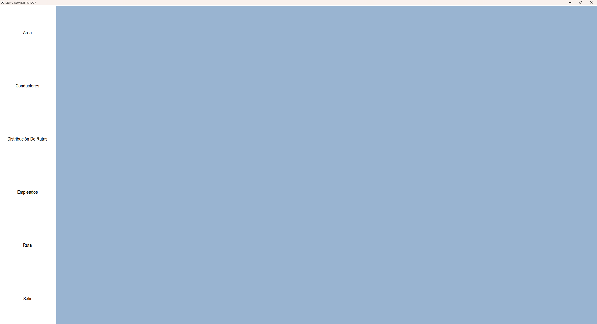

---

## ✨ Características y Lógica del Sistema

### 🏢 1. Gestión de Áreas y Conductores (Create / Delete)
- Módulos simples para dar de alta y eliminar dependencias de la empresa y conductores disponibles.
- Las áreas sirven como campo relacional indispensable para filtrar empleados y asignaciones.

| Conductor | Área |
|---|---|
| 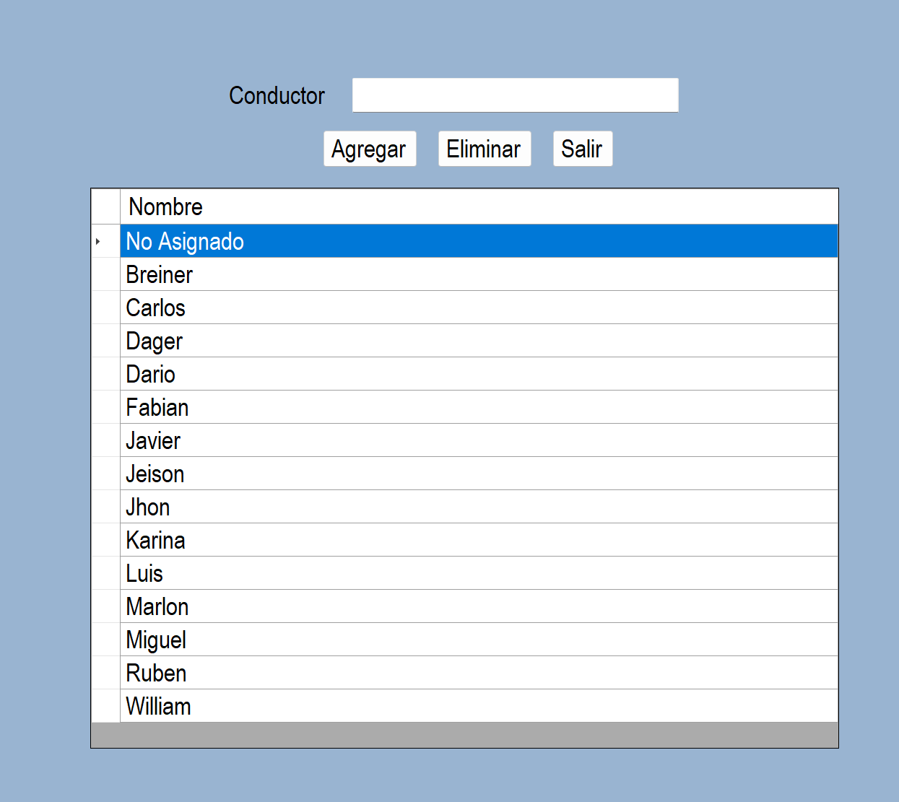 | 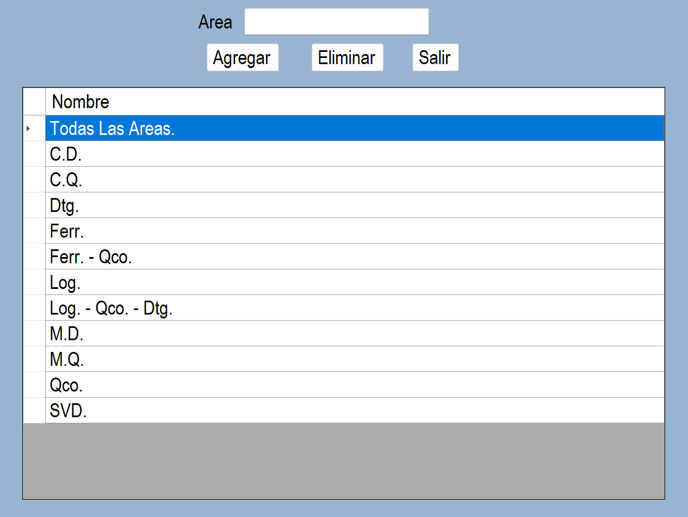 |

---

### 🛣️ 2. Gestión de Rutas
- Creación y administración de trayectos y zonas de cobertura empresarial (*Murillo, Occidente, Cordialidad, Calle 17, etc.*).

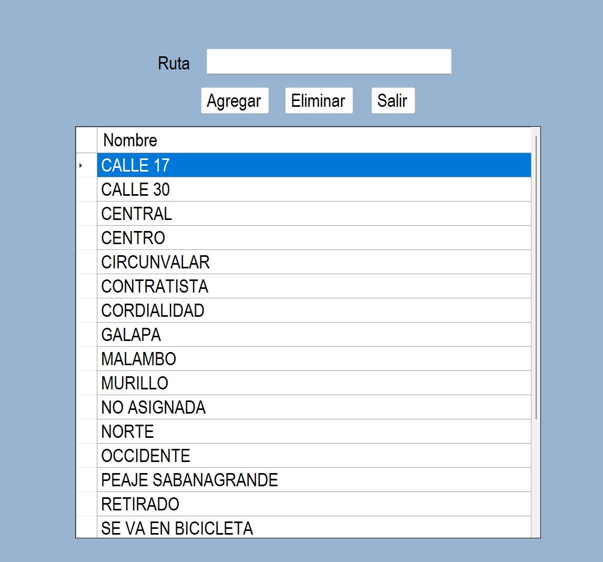

---

### 👥 3. Gestión de Empleados (CRUD Especializado)
- **Carga Interactiva:** Al hacer clic en cualquier fila de la lista (`DataGridView`), los datos del empleado se cargan automáticamente en los campos de edición.
- **Búsqueda Rápida:** Búsqueda instantánea por número telefónico.
- **Edición Directa:** Los campos de contacto y logística secundaria (**Teléfono** y **Ruta**) se pueden actualizar directamente desde los controles del formulario principal.
- **Protección de Datos Identificadores y Clave Primaria (PK):** 
  Para modificar datos sensibles o de identificación (**Nombre, Área y Dirección**), el sistema despliega diálogos de actualización independientes para resguardar la consistencia e integridad de las claves primarias en la base de datos Access.

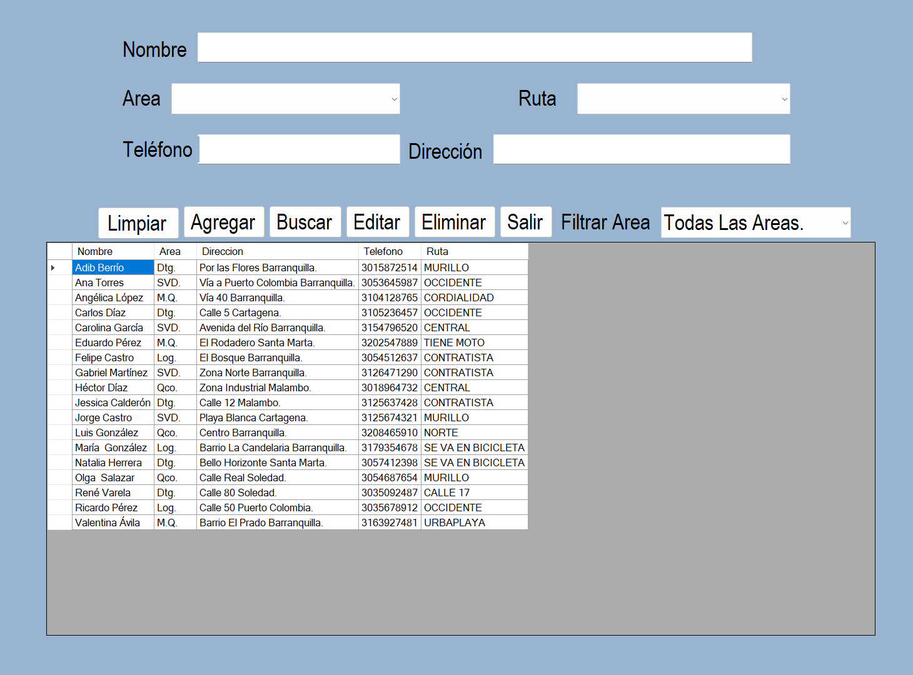

#### 🛠️ Flujo de Edición de Campos Sensibles (Ventanas emergentes):

| 1. Modificar Nombre | 2. Modificar Área | 3. Modificar Dirección |
|---|---|---|
| 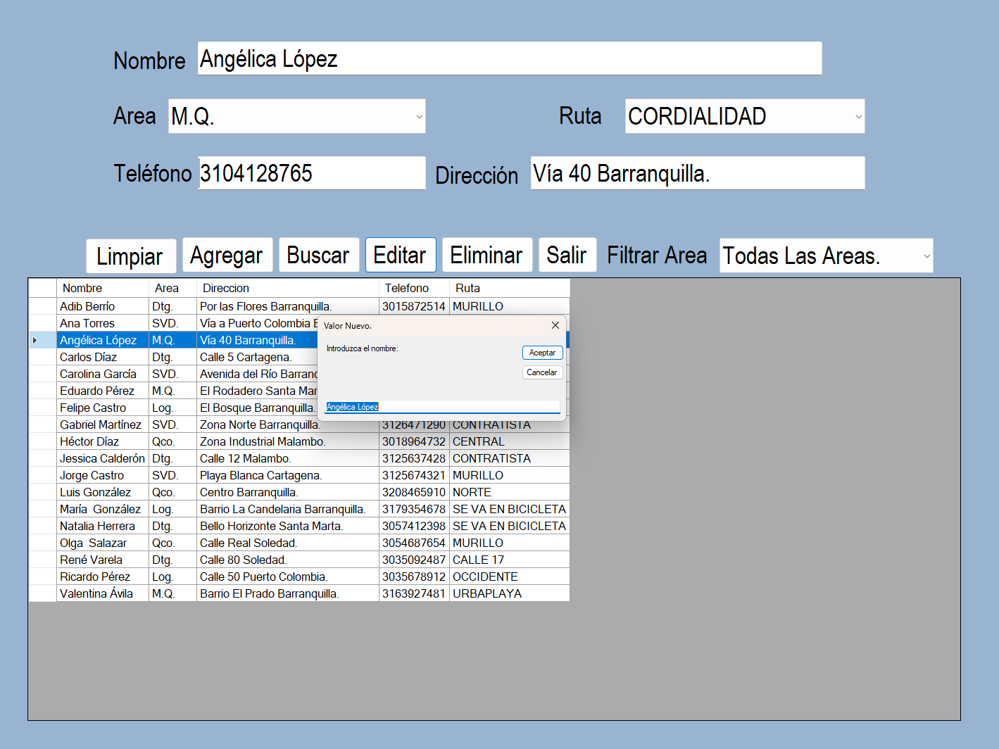 | 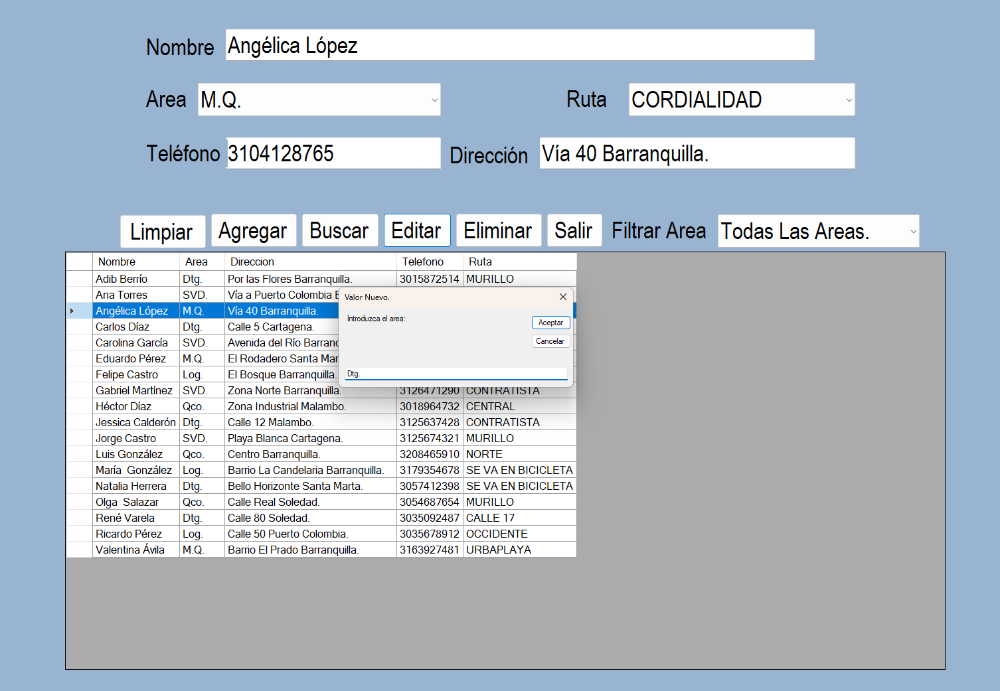 | 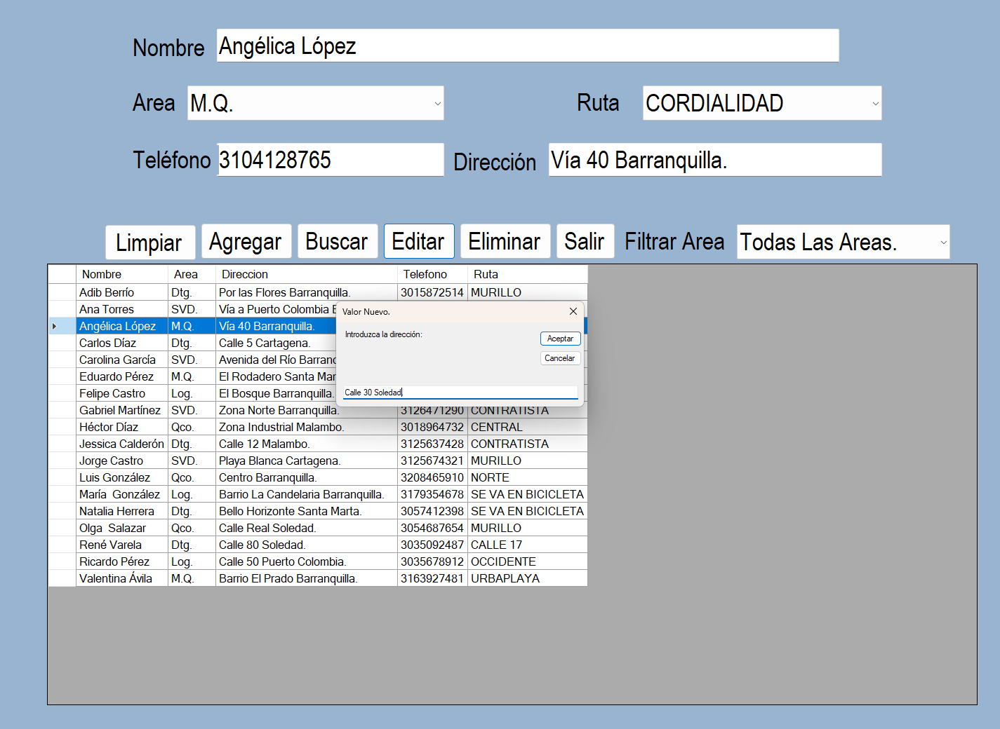 |

---

### 🔄 4. Módulo de Distribución de Rutas (Entrada / Salida)
- **Asignación por Doble Clic:** Al hacer doble clic sobre un empleado del listado general, el sistema lo asigna automáticamente a la tabla de **Entrada** o **Salida**.
- **Asignación de Conductor y Novedades:** Asigna un conductor de la lista desplegable e ingresa observaciones, turnos o novedades por recorrido.
- **Filtro Multi-tabla:** Filtrado independiente por Área para las listas de entrada, salida y personal general.

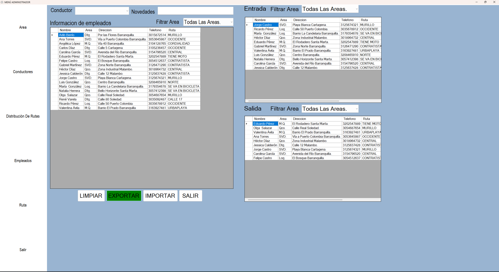

---

### 📊 5. Exportación de Reportes a Excel
- Generación de reportes formateados a `.xlsx` utilizando la librería `EPPlus`.
- Al presionar el botón **EXPORTAR**, el sistema procesa los datos y despliega una ventana nativa de **Guardar como** (`SaveFileDialog`) para elegir el nombre y ubicación del archivo.

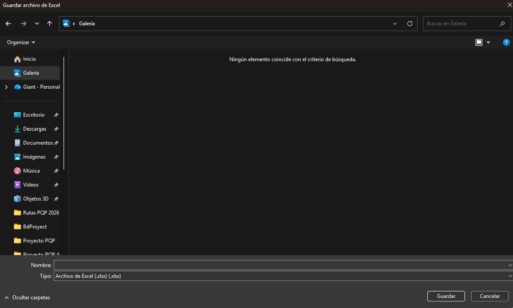

#### 📑 Hojas del Reporte Generado (`.xlsx`):
Los reportes generados incluyen estilos visuales personalizados, encabezados estructurados, filtros automáticos y pestañas independientes para **Entrada** y **Salida**:

| Reporte - Hoja Entrada | Reporte - Hoja Salida |
|---|---|
| 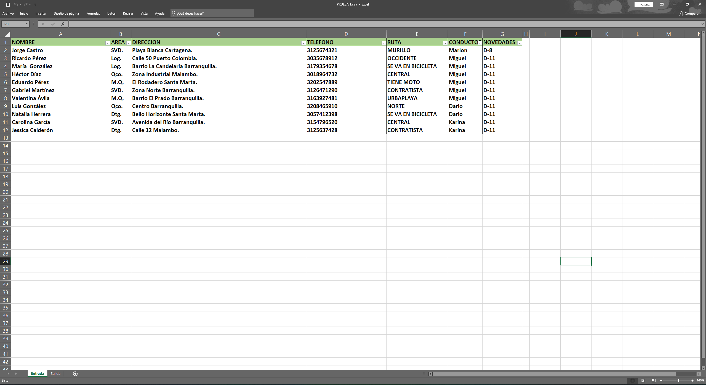 | 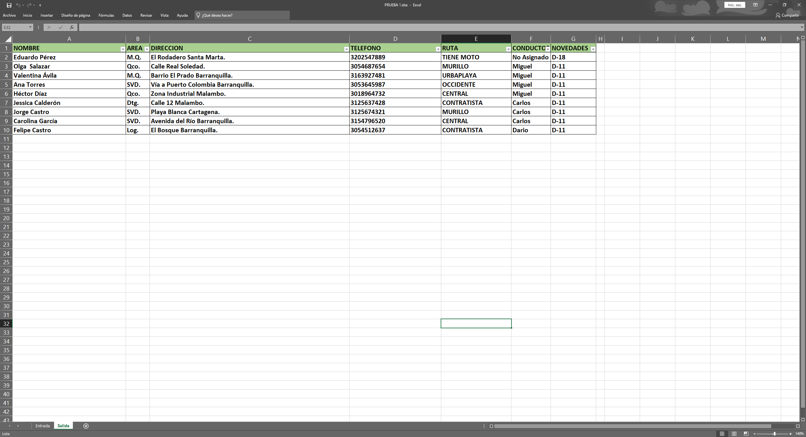 |

---

## 🏗️ Arquitectura del Proyecto

El proyecto está diseñado bajo una **Arquitectura en 3 Capas**, garantizando modularidad, fácil mantenimiento y separación de responsabilidades:

```text
Proyecto PQP/
├── 📁 AccesoDatos/       --> Conexión OleDb, ejecuciones SQL y manejo de comandos a Access (.accdb)
├── 📁 ReglaDeNegocio/    --> Validaciones, lógica de negocio y procesamiento de datos
├── 📁 Presentacion/      --> Formularios WinForms (Menú, Empleados, Rutas, Distribución)
└── 📁 BdProyect/        --> Base de datos Access (bd alpha2.accdb)
```

---

### 🛠️ Tecnologías y Librerías
* **Lenguaje:** Visual Basic .NET (`.NET Framework`)
* **UI:** Windows Forms (WinForms)
* **Base de Datos:** Microsoft Access (`.accdb`) mediante proveedor `Microsoft.ACE.OLEDB.12.0`
* **Librerías externas:** `EPPlus` / `EPPlus.Core` (para la generación y formato de archivos Excel `.xlsx`)

---

### 🚀 Instalación y Ejecución

#### **Opción 1: Para Usuarios (Ejecutable listo)**
1. Ve a la sección de **[Releases / Lanzamientos](https://github.com/Gigante1104/Distribucion_De_Rutas_ConBD/releases)** del repositorio.
2. Descarga la versión ejecutable **`v1.0.0`** (`.zip`).
3. Extrae los archivos en cualquier carpeta de tu equipo.
4. Ejecuta el archivo **`ProyectoPQP.exe`**.

#### **Opción 2: Para Desarrolladores (Código Fuente)**
1. Clona el repositorio:
   ```bash
   git clone [https://github.com/Gigante1104/Distribucion_De_Rutas_ConBD.git](https://github.com/Gigante1104/Distribucion_De_Rutas_ConBD.git)
   ```
2. Abre la solución Proyecto PQP.sln en Visual Studio 2019 / 2022.

3. Asegúrate de tener instalado el motor de base de datos Microsoft Access Database Engine (Microsoft.ACE.OLEDB.12.0).

4. Compila y ejecuta el proyecto.

---
### 📝 Requisitos del Sistema
* **Sistema Operativo:** Windows 10 / Windows 11.
* **Controlador OLEDB:** Microsoft.ACE.OLEDB.12.0 `(incluido habitualmente con Microsoft Office).`
---
### 📄 Autor
* **Desarrollado por Gigante1104 - 2026.**
